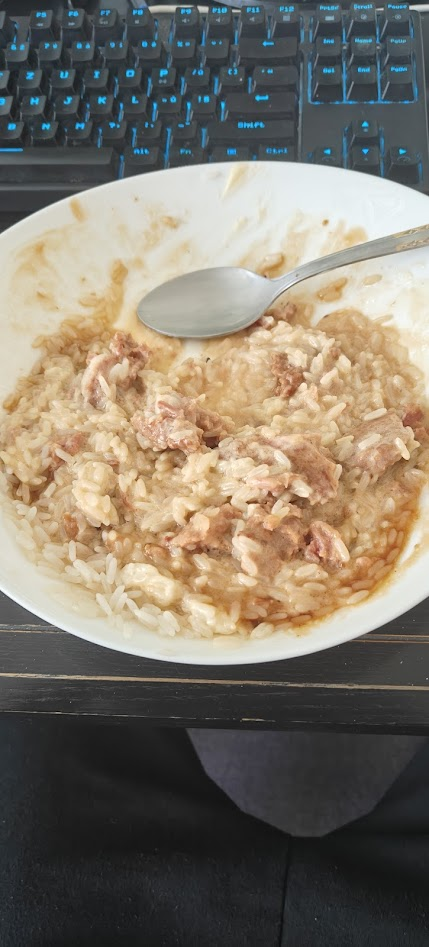

= Rice with meat, mayo and teriyaky sauce

.Requirements
----
1 Bag of parboiled rice
1 Can of meat with juice
Mayonaise
Teriyaky sauce
Garlic powder
Salt & Pepper
Spoon
----

image:https://encrypted-tbn0.gstatic.com/images?q=tbn:ANd9GcSC1sJc8SFIWh9qPDDRSFD9agctguAkGoKVtw&s[BagOfParboiledRice,200,300]
image:https://pt-servis.cz/wp-content/uploads/2021/02/MeiNing_veprove_maso_400g_WEB.jpg[Can of meat,200,200]

=== Preperation
. Fill a small pot with ~1l of water
. Wait for water to boil
. Place rice into the boiling pot for 20 minutes
. While waiting open the can of meat
. Empty it onto a plate
. Place the plate into a microwave for 45 seconds
. Take the plate out of the microwave and break it appart with the spoon
. dust it with the garlic powder, salt & pepper
.. meausure by eye
. Take the rice bag out of the pot
. Empty the rice bag onto the plate
. Put 1 tablespoon of mayonaise onto the rice
. pour teriyaky sauce onto the mayonaise and rice
.. also measured by eye
. Mix it together with spoon

=== Finished product

