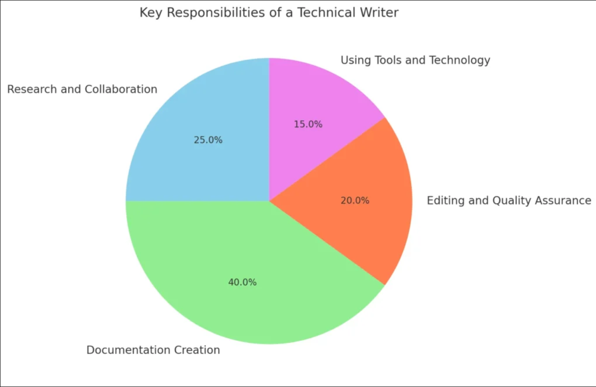

= Become a technical writer as a student

The goal of technical writers is to *help readers achive their goals*, by creating *straight forward and easy to follow documentation* for a product. When you are creating a technical documentation, think about Adam (hopeless, stressed customer, who needs help).

== Prerequisites:
- educational foundation
- technical and tooling proficiency
- tendency to minimalism
- soft skills and core communication

== Procedure:
. learn the core skills (writing skills, technical understanding, research skills)
. learn technical writing fundamentals
. develop technical knowledge
. learn documentation tools
. build a portfolio

== Writing skills:
- Technical writer should aim for straight forward documentation, without excess fluff, but keeping the text accurate, clear, and effective (ACE)

*Utilization:*

- clear language
- consistent terminology
- short sentences
- logical structure

*Forms of tech writing:*

  . Manuals, guides
  . Solutions or troubleshooting
  . Patch notes, release notes

*Formatting:*

Follow a specific style guide so your documentation is:

- reliable
- consistent
- scannable
- findable

*Style guides:*
. Apple style guide
. Google style guide
. Microsoft style guide

== Communication and research:

The goal is to gather accurate information and share it clearly with the intended audience in mind (Adam). Good communication helps users understand documentation, while research ensures the information is reliable and useful :

- critical thinking
- attention to detail
- understanding of the target audience

*Procedure:*

. identify the purpose of the documentation
. research reliable sources
. verify information from multiple sources
. organize findings
. communicate information clearly and concisely
. review and update content regularly

*Research:*

- Use trusted sources such as:
- official documentation
- technical articles
- academic publications
- industry standards

== Tools:

- For writing use Asciidoc or Markdown

